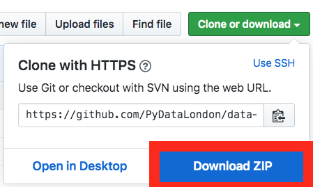

Data Analytics Workshop for Beginners
-----

This repository contains the material for a half-day workshop on data analytics with Python.

In this README document:

- Workshop Overview
- Intended Audience
- Installing the Material

Workshop Overview
-----

The purpose of this workshop is to introduce the audience to some of the Python tools to perform data analysis.

Outline:

- pandas basics

  - Loading data from CSV files

  - Inspecting the data, summary statistics

  - Data selection and filtering (e.g. boolean indexing, column selection)

  - Data transformation (e.g. `apply()`, `map()`)

  - Sorting values

  - Exercises

- pandas operations

  - Data aggregation (`groupby()`)

  - Joining `DataFrame` objects (`merge()`)

  - Basics of data visualisation with pandas (`plot()`)

  - Exercises

- Capstone Project

Some tips to get the most out of the workshop:

- make sure you run all the cells that contain code - cells further down may need the results from an earlier cell!
- if you are confused about what a cell is doing, make sure you read the text above and below it
- we use `this format` inside of a block of text to show that this is code that you may end up running yourself later
- if you get stuck, do ask people seated around you and ask our coaches for help! There are no stupid questions, and your neighbors are your friends who may also learn from helping you! Along the way, you may also want to figure out what key terms to search for, where to search for it, and how to debug the problem - this will let you develop good intuition for how to search for a solution yourself next time.

Intended Audience
-----

This workshop is for people who have some basic knowledge of Python and would like to learn more about, or start a career in, data analytics.

The workshop material includes two notebooks of preliminaries, i.e. one on how to use Jupyter notebooks and one on the basic syntax of Python.

Installation and Setup
-----

In order to setup the environment and run the workshop material, you'll need to:

- Install Python and relevant libraries on your machine
- Download the workshop material on your machine

Please try to have everything installed before you come to the workshop.

*Install Python and relevant libraries*

We are using Python 3.7, and we will require Jupyter, pandas, and matplotlib
installed. The recommended way to do this is to get the Python 3.7 version of
Anaconda, a Python distribution for data science - this will come with everything installed.

You can download Anaconda Python 3.7 from https://www.anaconda.com/distribution/ (available for Windows, macOS and Linux).

*Download the workshop material*

If you are familiar with `git`, you can clone the workshop repository using the following command:

    git clone https://github.com/PyDataLondon/data-analytics-workshop.git

Alternatively, you can download a zip file with the content of this repository:

- Click on "Clone or download" (on the top-right of this page, see example in image below)
- Click on "Download ZIP"
- Unzip the file in a folder of your choice

Running the material
-----

The workshop material is distributed as Jupyter notebooks.

In order to run the material, from a terminal firstly navigate to the folder where you have unzipped the files:

    cd data-analytics-workshop

then spin up the Jupyter notebook server:

    jupyter notebook

At this point the content of this repository should be visible through your browser.

Click on the `notebooks` folder, then click on any of the notebooks to run them.

If you are new to Jupyter, the suggestion is to check the preliminary material first,
in particular the notebook titled `Using Jupyter notebooks`.

License
-----

**Code**

The code in this repository, including all code samples in the notebooks listed above, is released under the
`MIT license`_. Read more at the `Open Source Initiative`_.

.. _MIT license: LICENSE-CODE
.. _Open Source Initiative: https://opensource.org/licenses/MIT

**Text**

The text content of this material, including all narrative in the notebooks listed above, is released under the
`CC-BY-SA license`_. Read more at `Creative Commons`_. 

.. _CC-BY-SA license: LICENSE-TEXT
.. _Creative Commons: https://creativecommons.org/licenses/by-sa/4.0

Credits
-----

The first version of this workshop was born as a joint effort between the `PyData London`_
and `PyLadies London`_ user groups, with volunteer contributions from the organisers.

.. _PyData London: https://www.meetup.com/PyData-London-Meetup/
.. _PyLadies London: https://www.meetup.com/pyladieslondon/

